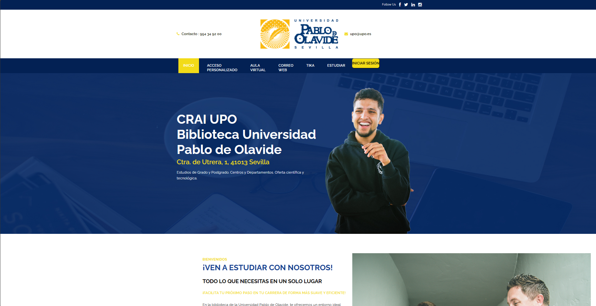

# BiblioUpo

BiblioUpo es una plataforma web desarrollada para gestionar la biblioteca de la Universidad Pablo de Olavide. Proporciona a los usuarios una manera eficiente de acceder y gestionar los recursos bibliográficos disponibles en la universidad.

## Características principales

- **Catálogo completo:** BiblioUpo ofrece un catálogo completo y actualizado de todos los materiales disponibles en la biblioteca, incluyendo libros, revistas, tesis, materiales audiovisuales, y más.
  
- **Búsqueda avanzada:** Los usuarios pueden realizar búsquedas avanzadas utilizando diversos filtros, como autor, título, tema, fecha de publicación, y más, para encontrar rápidamente los recursos que necesitan.

- **Gestión de préstamos:** Permite a los usuarios gestionar sus préstamos de manera eficiente, renovar materiales, hacer reservas, y recibir notificaciones sobre fechas de devolución próximas.

- **Interfaz amigable:** La interfaz de usuario de BiblioUpo es intuitiva y fácil de usar, lo que facilita la navegación y el acceso a los recursos bibliográficos para estudiantes, profesores y personal de la universidad.

- **Acceso remoto:** Los usuarios pueden acceder a BiblioUpo desde cualquier lugar a través de internet, lo que facilita la consulta y el uso de los recursos bibliográficos incluso fuera del campus.

## Contribuciones

¡Apreciamos mucho las contribuciones de la comunidad para mejorar BiblioUpo! Si tienes ideas para nuevas características, encuentras errores que corregir, o deseas contribuir de alguna otra manera, ¡no dudes en abrir un issue o enviar un pull request en nuestro repositorio en GitHub!

## Capturas de pantalla

